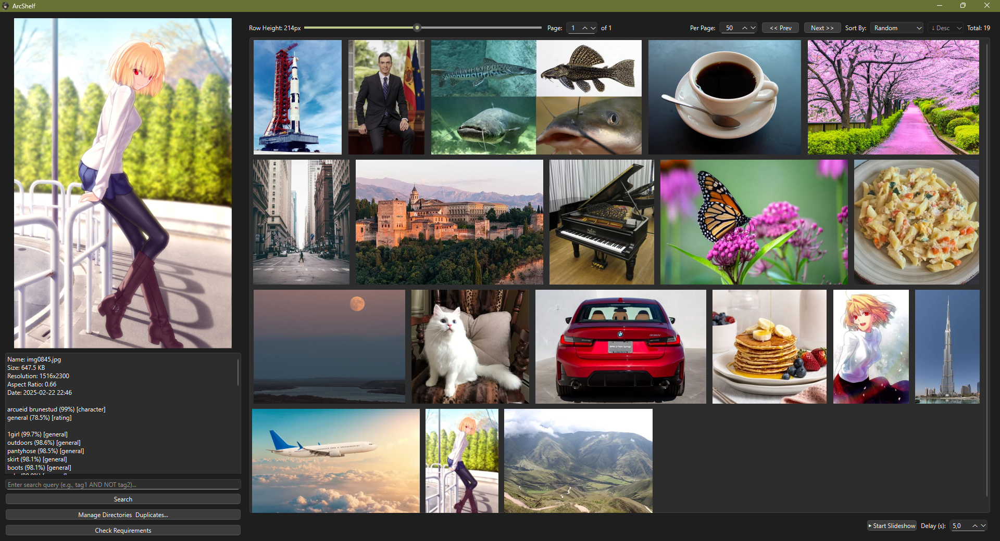

# ArcShelf 🚀

A desktop application for managing, viewing, searching, and automatically tagging image collections on Windows.

[Versión en Español](README_es.md)



## Key Features ✨

*   **Intuitive Graphical Interface:** Developed with PyQt6 for a smooth user experience.
*   **Customizable Image Gallery:** Adjust row height to tailor the display to your liking.
*   **Advanced Preview:** View images with integrated zoom and panning.
*   **AI-Powered Auto-Tagging:** Utilizes the powerful `wd-eva02-large-tagger-v3` model to automatically analyze and tag your images (ratings, characters, general tags).
*   **Powerful Search:**
    *   Search by tags using logical operators (`AND`, `OR`, `NOT`).
    *   Tag suggestions as you type.
    *   Similarity search to find visually similar images.
*   **Directory Management:** Easily add or remove folders containing your image collections.
*   **Duplicate Detection:** Tools to identify and manage duplicate images within added directories (accessible from "Manage Directories...").
*   **Slideshow Mode:** View your images in full screen with automatic transitions.
*   **Wide Format Support:** Compatible with `.png`, `.jpg`, `.jpeg`, `.webp`, `.bmp`, `.gif`, `.tiff`, `.tif`.

## Requirements 📋

*   **Operating System:** Windows (Tested on Windows 11 Pro).
*   **Python:** Version 3.8 or higher. Adding Python to the system PATH is recommended.
*   **Hardware:**
    *   An **NVIDIA GPU** compatible with CUDA is highly recommended for the best performance in automatic image tagging.
    *   If a compatible GPU is not detected, the application will use the **CPU** for tagging, resulting in significantly lower performance for that task.
*   **Dependencies:** Don't worry about installing them manually. The `run.bat` script handles everything. Key dependencies include: `PyQt6`, `Pillow`, `numpy`, `onnxruntime`, `pandas`, `requests`.

## Installation ⚙️

1.  **Clone the repository:** Open a terminal (cmd, PowerShell, Git Bash) and run:
    ```bash
    git clone https://github.com/dmolmar/ArcShelf.git
    # Replace the URL with the actual repository URL if different
    ```
2.  **Navigate to the directory:**
    ```bash
    cd ArcShelf
    ```
3.  **Run the setup script:** Simply double-click `run.bat` or run it from the terminal:
    ```bash
    run.bat
    ```
    This script will automatically:
    *   Check if Python is installed and accessible.
    *   Create an isolated virtual environment named `.venv` if it doesn't exist.
    *   Activate the virtual environment.
    *   Install or update all Python dependencies listed in `requirements.txt`, ensuring the correct version of `onnxruntime` (GPU or CPU) is installed based on your hardware.
    *   Download the necessary AI model files (`model.onnx` and `selected_tags.csv`) from Hugging Face if they are not found in the `models/` folder.

## Usage ▶️

1.  Once the installation via `run.bat` is complete, you can start the application by running again:
    ```bash
    run.bat
    ```
2.  **First steps:**
    *   Use the **"Manage Directories..."** button to add the folders containing your images. The application will process them to extract metadata and generate tags (this may take a while the first time, especially with large collections).
    *   Explore your collection in the gallery view.
    *   Click on an image to view it in the preview panel and check its detailed information and tags in the information panel.
    *   Use the top search bar to find images by tags. Try typing tags and see the suggestions.

## Acknowledgements 🙏

Automatic image tagging is made possible thanks to the **wd-eva02-large-tagger-v3** model created by **SmilingWolf**. You can find more information about the model on Hugging Face:
[https://huggingface.co/SmilingWolf/wd-eva02-large-tagger-v3](https://huggingface.co/SmilingWolf/wd-eva02-large-tagger-v3)